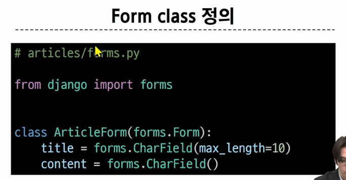
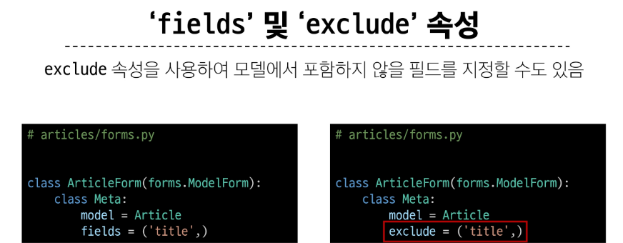

# 들어가기
[ html 'form' ]
1. 지금까지 사용자로부터 데이터를 제출 받기위해 활용한 방법은 html form이었지만 이는 비정상적이거나 악의적인 요청을 필터링 못함 
2. 유효성 검사 : 수집한 데이터가 정확하고 유효하니 확인하는 과정 (사용자가 제대로된 정보를 줬는지 판단)
3. 실제로는 어려운 구현
   1. 입력 값이나 형식 중복 등을 고려해야하지만 장고가 제공하는 form을 통해 간편하게 가능

# Django From
1. 정의
   1. 사용자 입력 데이커를 수집하고 처리및 유효성 검사를 수행하는 도구 : 유효성 검사를 단순화 자동화 가능함 
   2. forms라는 모듈에서 Form이라는 클래스를 사용 
    

2. 코드 예시
    ```
      #  forms.py 파일을 생성하여 마치 model만드는 것처럼 진행행
      from django import forms

      class ArticleForm(forms.Form):
        title = forms.CharField(max_length=10)
        content = forms.CharField()
    
   ---

      # views.py 에서 모델처럼 임포트하여 같은 방식으로 사용가능

      from .forms import ArticleForm

      # 게시글을 작성하기 위한 페이지를 제공하는 함수
      def new(request):
          form = ArticleForm()
          context = {
              'form' : form,
          }
          return render(request, 'articles/new.html',context)
    ```
3. widget
   1. 정의 : 위젯은 단순히 인풋 요소의 속성 및 출력되는 부분을 변경하는 것
   ```
    from django import forms

    class ArticleForm(forms.Form):
      title = forms.CharField(max_length=10)
      
      # forms라는 모듈안에 들어있는 위젯 클래스
      content = forms.CharField(widget=forms.Textarea) 
   ```
# Django ModleForm
1. 일반 폼과의 차이이
    | form | modelForm |
    |------|-----------|
    | 사용자 입력 데이터를 DB에 저장하지 않을 때 (검색이나 로그인) | 사용자 입력 데이터를 DB에 저장할 때 (게시글이나 회원가입) |
2. 정의
   1. Model과 연결된 Form을 자동으로 생성해주는 기능 제공 
   2. 코드 예시
      ```
        from django import forms

        class ArticleForm(forms.ModelForm):
          class Meta:
              model = Article
              fields = '__all__'
      ```
3. Meta class
   1. 정의 : ModelForm의 정보를 작성하는 곳 
      1. 메타란? 추가적인 데이터라는 의미. 예를 들어 사진에 대한 정보가 사진만 있는게 아니라 조리개값이나 주소 시간 등의 데이터를 메타데이터라고함 
  
4. id_vaild
   1. 여러 유효성 검사를 진행하고 데이터가 유효한지 여부를 boolean으로 반환
   2. 데이터베이스는 기본적으로 빈값을 허용하지 않기에 blank=True를 쓰지 않으면 빈값일때 false로 함 

---
<br><br>

# 📌 Django에서 폼의 작동

### 1. 사용자가 댓글 폼에 내용을 입력하고 "제출" 버튼을 누름  
→ 이때 브라우저가 **POST 요청**을 서버로 보냄  
→ `request.POST` 안에 사용자가 입력한 데이터가 담겨 있음

### 2. 서버에서는 이렇게 처리함:
```python
comment_form = CommentForm(request.POST)
```

- 여기서 `CommentForm()`은 **폼 클래스를 인스턴스화**하는 작업이고,
- `request.POST`는 **사용자가 보낸 입력값들**을 폼에 채워 넣는 거야.

즉, 그냥 "비어 있는 폼"이 아니라  
🧾 "**사용자가 작성해서 보낸 데이터가 들어있는 폼**"을 만들고 있는 거지.

---

## ✅ 그래서 "POST 데이터로 폼 생성"이란?

➡️ **사용자가 입력한 값을 기반으로**  
➡️ **서버에서 `CommentForm`이라는 폼 인스턴스를 만든다**는 의미야.

### 예시 비교
```python
# 빈 폼 (댓글 작성 폼 띄울 때)
comment_form = CommentForm()

# 입력된 데이터가 채워진 폼 (댓글 작성 후 처리)
comment_form = CommentForm(request.POST)
```

---

### 📌 결론

- "POST 데이터로 폼 생성"은 = "**사용자가 제출한 데이터를 가진 폼 객체를 만든다**"
- 그 다음 `.is_valid()`로 검사하고, `.save()`로 DB에 저장하는 과정이 이어지는 거야.