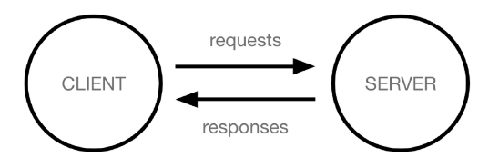

# 웹 어플리케이션

1. 정의
  - 인터넷을 통해 사용자에게 제공되는 소프트웨어 프로그램을 구축하는 과정
  - 음식점이라 생각하고 고객과 직원이 있는데 고객이 음식을 쵸정하면 직원이 음식을 가져다준다
    - 어떻게 직원을 잘쓰까는 백엔드에서 하는 고민, 어떻게 고객을 잘 다룰까는 프로트엔드에서 하는 것

2. 클라이언트와 서버
  - 클라이언트는 서비스를 요청하는 주체, 사용자의 웹 브라우저, 모바일 앱을 말함
  - 서버는 클라이언트의 요청에 응답하는 주제, 웹 서버, 데이터베이스 서버
  - 고객이 요청하면 서버가 응답하는 구조
3. 프론트와 백
  - 프론트 : 사용자 인터페이스 구성
  - 백엔드 : 요청 처리와 데이터베이스 상호작용을 담당


# 프레임 워크
1. 정의
  - 개발에 필요한 기본구조 규칙 라이브러리를 제공
  - 장고를 프레임워크라 하는데 이를 밀키트라고 보자
  - 미역을 불리고 볶는 것을 딸깍을 해서 할수 있도록 만들어놓은게 프레임워크 -> 거인의 어깨위에서 눈누난나 하는 거임
2. 장고 프레임워크
  - 파이선기반의 대표적 웹 프레임 워크


[ 학습 방향 ]

1. 내부적 작동 방식을 알려고 하기보다는 어떤 기능이 있고 어떻게 활용할 수 있는지를 알기
2. 이론적인 필기보다는 **코드 중심으로 배우기**, 다시보기 여러번하면서 반복 정리 

---

[ 앞으로 알아둘 것 ] 

1. 원형 : serve 
2. er : server  ~~하는 기계나 사람
3. ing : serving ~~하는 행위
4. 예시
    1. 예시 1번
        1. program : 순서도(무한도전 18시)
        2. programmer : 순서도를 작성하는 사람이나 기계
        3. programing : 순서도를 작성하는 행위
    2. 예시 2번
        1. route  : 경로
        2. router : 경로를 찾는 기계나 사람
        3. routing : 경로를 찾는 행위

---

# 웹 어플리케이션

1. 정의
    1. 인터넷을 통해 사용자에게 제공되는 소프트웨어 프로그램을 구축하는 과정
    2. 음식점이라고 생각하면됨 → 고객과 직원 → 고객이 요청을 하면 직원이 음식을 가져다준다 
        1. 어떻게 직원을 잘쓸까는 백엔드에서 하는 고민, 어떻게 고객을 잘 다룰까는 프론트엔드 
2. 클라이언트와 서버
    1. 클라이언트 서버 구조 
        1. 클라이언트 (서비스를 요청하는 주체, 사용자의 웹 브라우저, 모바일 앱)
        2. 서버 (클라이언트의 요청에 응답하는 주체, 웹서버, 데이터베이스 서버)
        3. 고객이 요청하면 전달해주는
    
    
    
3. 프론트앤드와 백엔드
    1. 프론트 : 사용자 인터페이스 구성
    2. 백엔드 : 요청 처리와 데이터베이스 상호작용 담

# 프레임워크

1. 정의
    1. 웹 어플리케이션을 빠르게 개발하게 도와주는 도구 (개발에 필요한 기본구조, 규칙, 라이브러리 등 제공)
        1. 장고를 프레임워크라고 하는데, 밀키트라고 보자
        2. 에전에 했던 작업들(미역을 불리고 볶는)을 딸깍해서 할 수 있도록 만들어 놓은 것 —> 거인의 어깨위에서 눈누난나 
2. 장고 프레임워크
    1. 인기있는 프레임웥이라고 좋다는 말은 아님이라는 
    2. 정의 : 파이선 기반의 대표적 웹 프레임 워크
    3. 특징
        1. 다양성 : 파이선 기반, 웹 모바일 앱 백엔드 api 서버 및 빅데이터 관리 등 광범위한 서비스 개발 적합
        2. 확장성 : 대량의 데이터에 대해 빠르고 유연하게 확장할 수 있는 기능 제공
        3. 보안 : 보안기능 내장
        4. 커뮤니티 지원 : 개발자를 위한 지원 문서 등 제공
    4. 다른 종류
        
        
        | 서버(프레임워크) |  |
        | --- | --- |
        |  |  |
        |  |  |

# 가상환경

1. 정의
    1. 하나의 컴퓨터안에서 또 다른 독립된 파이선 환경 → 개발 시 독립된 환경이 필요해짐 (하나의 컴퓨터 안에서 여러 프로젝트를 하기위해)
2. 필요한 이유?
    1. 두개 이상의 프로젝트가 각각 다른 패키지 버전을 사용하기 위해서는 독립적인 개발 환경 필요 (원래는 패키지는 하나의 버전만 쓸수 있기에)
    2. 패키지 간에 충돌이 발생하기도함 ( 각 프로젝트에서 다른 패키지를 사용하기위해서는 독립적 환경 필요)
3. 파이선 환경 구조
    1. 같은 집(컴퓨터)안에 방(가상환경)을 따로 만드는 거임
    
    
    

---

## 가상환경 생성 및 활성화 과정


1. **가상환경을 만든다**
    
    ```jsx
    python -m venv 가상환경이름(venv라는 이름을 쓰는게 좋음)
    ```
    
    1. 현재 디렉토리에 venv라는 폴더가 생성됨
        1. 폴더 생성만 된거지 아직 우리는 글로벌 환경에 있는거임 (가상환경에 들어간거 아님)
    2. venv 폴더안에는 파이선 실행 파일, 라이브러리 등을 담을 공간이 마련됨
    3. venv라는 이름의 가상환경을 생성한것, 다른 이름써도 되지만 그냥 이거 써라 
2. **가상환경 활성화**
    
    ```jsx
    source venv/Scripts/activate
    ```
    
    1. 새로 생성된 venv폴더에 script폴더에 있는 activate라는 것을 활성화시키는 거임
        
        
        
    2. 활성화 후, 프로프트 앞에 `(venv)` 와 같이 표시되면 
3. **가상환경 종료**
    
    ```jsx
    deactivate
    ```
    
    1. 터미널을 꺼도 종료는 되지만, 코드를 써서 종료하도록 하자

## 의존성 패키지

1. 정의
    1. 의존성 : 하나의 소프트웨어가 동작하기위해 필요로하는 다른 소프트웨어나 라이브러리
    2. 프로젝트가 의존하는 개별 라이브러리들을 가리키는 말 (프로젝트가 실행되기위해 피료한 패키지 하나하나)
2. **패키지 목록확인**
    
    ```jsx
    pip list
    ```
    
    1. 현재 가상환경에 설치된 라이브러리 목록 확인
    2. 말그대로 가상환경 속의 패키지를 확인하는 것이라 글로벌 환경과는 다른 리스트가 나오는 
3. **의존성 기록**
    
    ```jsx
    pip freeze > requirements.txt
    ```
    
    1. `pip freeze` 를 가상환경에 설치된 모든 패키지를버전과 함께 글자로 출력
    2. `pip freeze` 로 불러온 덱스트 리스트를 txt 파일에 저장할 수 있음, requirements를 파일명으로 사용 권장
    3. 사용이유 
        1. 협업 시 팀원들이 같은 버전의 라이브러리를 설치하도록 공유 가능 
        2. 패키지 설치시 딱 그것만 설치되는거 아님 때문에 무엇이 있는지 다 공유해야함 
        3. 의존성 패키지 관리 이유
            1. 패키지마다 버전 다름, 버전 다르면 함수명이나 동작 다름
            2. 협업 시 의존성 리스트 필요 

## 의존성 패키지 기반 설치

[ requirements.txt를 활용해 다른 팀원도 동일한 패키지 버전 설치하는 법 ]

1. 가상환경 준비
2. requirements.txt 파일로부터 패키지 설치
    
    ```jsx
    pip install -r requirements.txt
    ```
    
    1. requirements.txt파일에 기록된 패키지와 버전을 읽어와 같은 환경으로 설치 

## 가상환경 주의사항

1. 가상환경은 들어가고 나오는 게 아니라 on/off개념임 
    1. 가상환경 활성화는 현재 터미널에만 영향줌 → 새 터미널 창을 열면 다시 활성화해야함 
2. 프로젝트마다 별도의 가상환경 사용 
3. 폴더 venv는 깃에 올리지 않음 → 대신에 requirements.txt를 공유하는 거임 → venv는 너무 용량이 크기때문에 → 폴더 venv는 gitignore 파일에 작성되어 원격저장소에 공유되지 않음

## 가상환경 사용 이유

1. 프로젝트마다 다른버전의 라이브러리 사용
2. 의존성 충돌 방지
3. 협업 

# 장고 프로젝트

## 프로젝트 생성 및 서버 실행

1. 장고 설치
    
    ```jsx
    pip install django
    ```
    
2. 장고 프로젝트 생성
    
    ```jsx
    django-admin startproject firstpjt .
    ```
    
    1. firstpjt라는 이름의 장고 프로젝트 생성
    2. 마지막에 .을 안찍으면 같은 이름의 폴더안에 폴더안에 생성됨
3. 서버 실행
    
    ```jsx
    python manage.py runserver
    ```
    
    1. manage.py와 동일한 위치에서 명령어 진행 
    2. ls 명령어를 통해 해당 경로에 manage.py가 있는지 확인하고 실행하기

# 장고 디자인 패턴

1. 디자인 패턴
    1. 소프트웨어에서 발생하는 문제를 해결하기 위한 일반적인 해결책 (애플리케이션의 구조는 이렇게 구성하자라는 관행)
2. MVC 디자인 패턴 ( model / view / controller ) : 애플리케이션을 구조화하는 대표적인 패턴 → 데이터 사용자인터페이스 비즈니스로직을 분리, 시각적 요소와 뒤에서 실행되는 로직을 서로 여얗ㅇ 없이 독립적이고 쉽게 유지보숳라 수 있는 애플리케이션을 만들기위함
3. MTV 디자인패턴 ( model / template / view ) : 장고에서 어플리케이션을 구조화하는 패턴으로 mvc와 같은 말
    1. model
        1. 데이터와 관련된 로직을 관리
        2. 응용프로그램의 데이터 구조를 정의하고 데이터베이스의 기록을 관리
    2. tmeplate
        1. 레이아웃과 화면을 처리
        2. 화면상의 사용자 인터페이스 구조와 레이아웃을 정의
    3. view
        1. 모델과 템플릿과 관련된 로직을 처리해서 응답을 반환
        2. 클라이언트의 요청에 대해 처리를 분기하는 역할
        3. 예) 데이터가 필요하면 model에 접그해 데이터를 가져오고, 가져온 데이터를 template로 보내 화면을 구성하고, 구성된 화면을 응답으로 만들어 클라이언트에게 반환 
    
    
    

## django-project

1. 애플리케이션의 집합
    1. db설정, url 연결, 전체 앱 설정 등을 처리
2. 구조
    1. [settings.py](http://settings.py) : 프로젝트의 모든 설정을 관리
    2. [urls.py](http://urls.py) : 요청 들어오는 url에 따라 이에 해당하는 적절한 views를 연결
    3. **__[init__**.py](http://init.py) :  해당 폴더를 패키지로 인식하도록 설정하는 파일
    4. [asgi.py](http://asgi.py) : 비동기식 웹 서버와의 연결 관련 설정
    5. [wsgi.py](http://wsgi.py) : 웹 서버와의 연결 관련 설정
    6. [manage.py](http://manage.py) : 장고 프로젝트와 다양한 방법으로 상호작용하는 커맨드라인 유틸리티

## django pplication

1. 장고 어플리케이션 : 독립적으로 작동하는 기능 단위 모듈
2. 구조
    1. [admin.py](http://admin.py) : 관리자용 페이지
    2. [models.py](http://models.py) : db와 관련된 Model을 정의, MTV 패턴의 M
    3. [views.py](http://views.py) : HTTP요청을 처리하고 해당 요청에 대한 응답을 반환 (URL, model, templates과 연계), mtv패턴의 v
    4. [apps.py](http://apps.py) : 앱의 정보가 작성된 곳
    5. [tests.py](http://tests.py) : 프로젝트 테스트 코드를 작성하는 곳
3. 앱 생성
    
    ```jsx
    python manage.py startapp articles
    ```
    
    1. 앱의 이름은 복수형으로 저장 (예. articles)
4. 앱 등록 
    1. 프로젝트의 셋팅.PY에 들어가서 
    
    ```python
    INSTALLED_APPS 리스트에 앱 추가
    ```
    

# 요청과 응답


1. 에러 발생 시 소스코드의 흐름대로 보는 것
    1. 프로젝트의 urls.py를 가장 먼저 만나니까 이거부터 확인
    2. 다음으로 앱의 views.py로 넘어감
2. 연결하기
    1. 프로젝트의 urls.py에 입력
    2. request 객체를 views 모듈의 index view함수에게 전달하며 호출
    
    ```python
    from 앱이름 import views
    
    urlpatterns = [
    		path('admin/', admin.site.urls),
    		path('앱이름/', views.index),
    ]
    ```
    
3. view
    1. 뷰 함수가 정의되는 곳
    2. 특정 경로에 있는 템플릿과 request 객체를 결합해 응답 객체를 반환
    3. 모든 view함수는 첫번째 인자로 요청 객체를 필수적으로 받음
    4. 매개변수 이름이 request가 아니어도 되지만 그렇게 작성 ㄴㄴ
    
    ```python
    def index(request):
    		return render(request, '앱 이름/index.html')
    ```
    


# 참고


