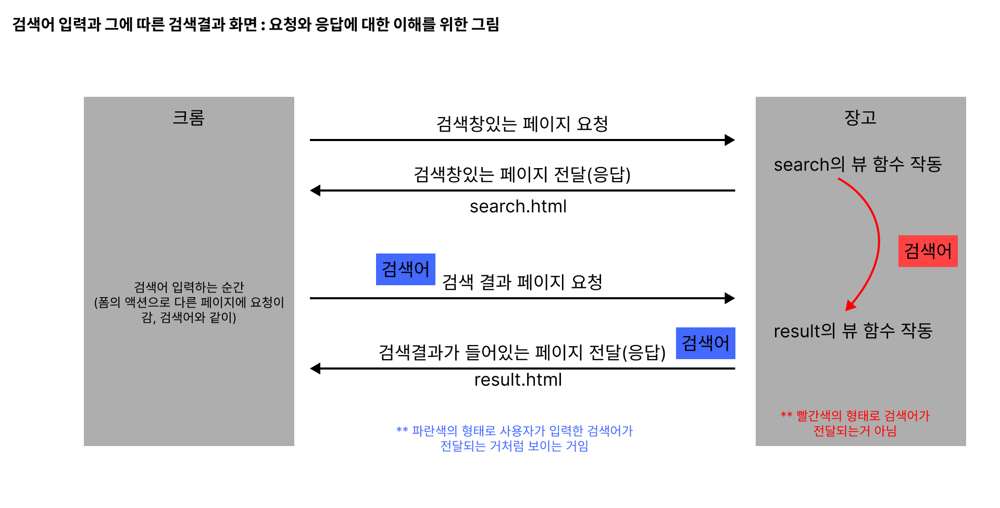

# Django Templates system
1. 데이터 표현을 제어하면서 표현과 관련된 부분을 담당 

# Django Templates Lamguage
1. 템플릿에서 조건 반복 변수 등의 프로그래밍적 기능을 제공하는 시스템
2. DTL syntax
    - variable
      - render 함수의 세번째 인자로 딕셔너리 데이터를 사용
      - 딕셔너리 key에 해당하는 문자열이 템플릿에서 사용 가능한 변수명이 됨(그래서 그냥 리스트로는 안됨)
      - '.'을 이용해 변수 속성에 접근 가능
    - filters
      - 표시할 변수를 수정ㅎ라떄 사용 ( 변수 + '|' + 필터)
      - 연결이 가능하며 일부 필터는 인자를 받기도함
      - 약 60개의 빌트인 템플릿 필터 제공
      - 예
        ```python
          {{ name|truncatewords:30 }}  
          #글자가 너무 길면 30자에서 잘라라
        ```
    - tags
      - 반복과 논리 수행하여 흐름 만듦
      - 일부는 시작과 종료 태그 필요
      - 24개의 빌트인 템플릿 태그 제공
    - comments
      - DTL에서의 주석은 코멘트 태그로 담

# views.py
```python
from django.shortcuts import render

# Create your views here.
def index(request):
    context = {
        'name' : 'jane',
    }
    
    # context라는 딕셔너리값을 articls/index.html여기서 활용할 수 있게 해주는 거임
    return render(request, 'articls/index.html',context)

    # "사용자의 요청(request)을 받아서, 템플릿(html)을 context 데이터와 함께 렌더링해서, 브라우저에 보여주는 것!"
        # 사용자가 요청하면
        # → 서버(Django)가 응답할 html을 렌더링(render)해서
        # → 변수(context)를 넣고
        # → 완성된 페이지를 사용자에게 보내주는 구조
        
    # render()함수는 "HTML + 데이터"를 합쳐서 브라우저에 보여주는 역할
    # 3가지 인자 설명
        # request : 사용자가 보낸 HTTP 요청 정보가 담긴 객체야
        # html경로 : 어떤 템플릿 파일을 사용할지 알려주는 경로, Django는 이걸 찾아서 HTML 구조를 읽고 -> 그 안에 들어갈 데이터와 같이 "렌더링"해줌
        # context : 템플릿에서 사용할 **데이터(변수들)**를 담은 딕셔너리
```

# 템플릿 상속
1. extends tag
    - 
    - 자식(하위) 템플릿이 부모 템플릿을 확장한다는 것을 알림
    - 반딋 자식 템플릿 최상단에 있어야하고 2개 이상 사용 불가
2. block tag
    - 
    - 하위 템플릿에서 재정의 할 수 있는 블록의 정의 
    - 상위 템플릿에 작성하며 하위 템플릿이 작성할 수 있는 공간을 지정하는 것

# 요청과 응답
1. html form
    - 데이터를 보내고 가져오기
    - html form은 http요청을 서버에 보내는 가장 편리한 방법
    - 예) 로그인시 아이디와 비밀번호 보내는 것
    - form element
      - 사용자로부터 할당된 데이터를 서버로 전송
      - 웹에서 사용자 정보를 입력하는 여러 방식 (text password chekbox 등을 제공)
    - 관련해서 추가로 알것
      ```
        [네이버 검색 링크 예시]
        https://search.naver.com/search.naver?where=nexearch&sm=top_hty&fbm=0&ie=utf8&query=iu

        [문자표를 기준으로 나눔]
        https://search.naver.com/search.naver  ?  where=nexearch  &  sm=top_hty  &  fbm=0  &  ie=utf8  &  query=iu 
        ---> "키:벨유" 형태로 보여짐 --> "query=iu"여기서 내가 입력한 검색어인 "iu"가 있음

        [간소화 버전]
        https://search.naver.com/search.naver?query=iu --> 이렇게만 입력해도 같은 결과 나옴 --> 즉, 쿼리의 값이 중요한 거임
      ```
      ```python
        # 연관 예시 코드

        # HTML 폼 기본 원리:
        # <form> 태그는 데이터를 전송하는 구조로 <input>에 name="query"라고 적으면 폼이 제출될 때, 그 name이 key가 되고, 입력값이 value가 돼서 주소 뒤에 ?query=입력값 이라는 형태로 붙음 (GET 방식일 때)

        <form action="https://search.naver.com/search.naver">
          <label for="admin">search</label>
          <input type="text" id="admin" name="query">
          <input type="submit">
        </form>  
      ```
      ```python
        # 해당 query값을 받아와서 사용하는 방법

        def index(request):
          query = request.GET.get('query')
          context = {'query': query}
          return render(request, 'articls/index.html', context)
        # 이러면 index파일에서 검색어를 변수로 사용할 수 있음
        # 브라우저에서 보낸 검색어나 필터값 같은 걸 서버에서 꺼내서 처리할 수 있게 해줌

        
        # " query = request.GET.get('query') " 분석하기
        
        # request
        # → 사용자가 보낸 요청 전체를 담고 있는 객체
        # (브라우저가 보낸 주소, 데이터, 방식 등등 다 들어있음)

        # request.GET
        # → 사용자가 **주소창(URL)**을 통해 보낸 쿼리스트링(query string) 들을 딕셔너리처럼 담고 있음

        # request.GET.get('query')
        # 딕셔너리에서 해당 키의 값을 가져오기위해 .get()을 사용
        # → URL 뒤에 붙은 ?query=무언가에서
        # 그 "무언가"를 꺼내오는 코드야

      ```
      
      

      ```python

        def index(request):
          query = request.GET.get('query')
          context = {'query': query}
          print(request)

        # 이렇게 쓰고 출력화면에서 새로고침하면 비주얼스튜디오 터미널에 프린트 값이 나온다.

        # 딕셔너리의 키값을 가져오면 되는구나를 깨닫기까지의 과정
        def index(request):
          query = request.GET.get('query')
          context = {'query': query}
          print(request)          # <WSGIRequest: GET '/articls/?query=ssafy'>
          print(type(request))    # <class 'django.core.handlers.wsgi.WSGIRequest'>
          print(dir(request))
          print(request.GET)      # <QueryDict: {'query': ['ssafy']}>
          print(request.GET.get('query'))  # ssafy
      ```
2. action & method
    - form 핵심 속성 2가지
    - 데이터를 어디(action)로 어떤방식(method)으로 요청할지
    - action
      - 입력 데이터가 전송될 URL을 지정(목적지)
      - 만약 이 속성을 지정하지 않으면 데이터는 현재 form이 있는 페이지의 URL로 보내짐
    - method
      - 데이터를 어떤 방식으로 보낼 것인지 정의
      - 데이터의 http request methods (GET, POST)를 지정
          - GET : 검색(조회)
          - POST : 삭제 수정 생성 조작 등을 위한 것일떄 이 방식으로 정보 보냄

3. input element
    - 사용자의 데이터를 입력 받을 수 있는 요소
    - 타입의 속성값에 따라 다양한 유형의 입력 데이터를 받음 --> 핵심 속성은 'name'
      - name attribute
        - 인풋의 핵심 속성
        - 사용자가 입력한 데이터에 붙이는 이름(key)
        - 데이터를 제출했을 떄 서버는 name속성에 설정된 값을 통해서만 사용자가 입력한 데이터에 접근할 수 있음
        - 이렇게 넘어가는 데이터를 Query String Parameters라고 함
          - 사용자의 입력 데이터를 URL 주소에 파라미터 통해 서버로 보내는 방법
          - 문자열은 앰퍼세트(&)로 연결된 key=value쌍으로 구성되며, 기본 url과는 물음표로 구분됨
        
# URLs
1. URL dsiapatcher
    - 운항관리자, 분배기
    - url 패턴을 정의하고 해당패턴이 일치하는 요청을 처리할 view함수를 연결(매핑)
2. variable routing (변수 경로)
    - url 일부에 변수를 포함시키는 것 (변수는 view 함수의 인자로 전달 할 수 있음)
    - 작성법
      ```python
        <path_converter : variable_name>

        path('articles/<int:num>', views.detail)
        path('articles/<str:num>', views.detail)
      ```

## APP URL mapping
1. 각 앱에 url 정의하는 것
    - 프로젝트와 각 앱이 url을 나누어 관리를 편하게 하기 위함
2. include()
    - 프로젝트 내부 앱들의 url을 참조할 수 있도록 매핑하는 함수
    - url의 일치하는 부분까지 잘라내고, 남은 문자열 부분은 후속처리를 위해 include된 url로 전달 
    ```python
      # 프로젝트 urls.py
      from django.urls import path, include
      urlpatterns = [
          path('admin/', admin.site.urls),
          path('articls/', include('articls.urls')),   
      ]

      # 앱 urls.py
      from django.urls import path
      from . import views
      urlpatterns = [
          path('', views.index),
          path('dinner/', views.dinner),  # path함수가 view함수를 호출
          path('search/', views.search),
          path('<int:num>', views.detail),
      ]

    ```

## Naming URL patterns
1. url에 이름을 지정하는 것 (path 함수의 name 인자를 정의해서 사용)
    ```python
      path('search/', views.search, name="search"), # 라고 인자를 정의하면 html파일에서

      # index.html
      <a href="/search/">  # 해당형태에서 아래 형태로 바뀜
      <a href="">
    ```

2. url tag
    - 
    - 주어진 url패턴의 이름과 일치하는 절대 경로 주소를 반환

3. app_name 속성 지정
    - 


# 추가 템플릿 경로 (참고)
1. 템플릿 기본 경로 외 커스텀 경로 추가하기
    - 프로젝트의 setting.py에서 수정
      ```python
          # 파이선의 객체 지향 파일 시스템 경로

          # settings에서 경로지정을 편하게 하기위해 최상단 지점을 지정해 둔 변수
          BASE_DIR = Path(__file__).resolve().parent.parent

          TEMPLATES = [
            {
                'BACKEND': 'django.template.backends.django.DjangoTemplates',
                'DIRS': [BASE_DIR / 'templates'],  # 여기서 새로운 경로 추가
      ```
2. DTL 주의사항
    - 파이선의 일부 프로그래밍 구조(if, for 등)을 사용할 수 있지만, 그냥 파이선이랑 비슷한 생김새인거지 파이선 코드가 실행되는 것이 아니다. 
3. url의 trailing slashes
    - 장고는 url 끝에 '/'가 없다면 자동으로 붙임
    - 기술적 측면에서 '/bar/'와 '/bar'는 서로다른 url
    - 장고는 검색엔진이 혼동하지않도록 무조건 붙여지도록 만든거임, 모든 프레임워크가 그런거 아니니까 주의하셈